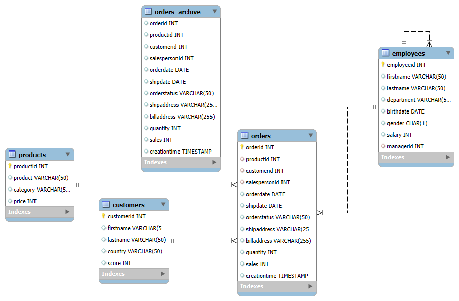

# SQL Practice Repository

This repository contains my SQL practice exercises and learning materials. It covers various SQL concepts from basic queries to advanced window functions.

## Repository Structure

### Basic Concepts

- `1. BASIC SQL.sql` - Fundamental SQL queries and syntax
- `1.1 Operators.sql` - SQL operators (comparison, logical, arithmetic)

### Functions

- `2. Function Theory.sql` - Overview of SQL functions and their usage
- `3. Numeric Functions.sql` - Mathematical and numeric operations
- `4. String Functions.sql` - Text manipulation and string operations
- `5. Aggregate functions.sql` - SUM, COUNT, AVG, MIN, MAX functions
- `6. DATE Functions.sql` - Date and time manipulation
- `7. NULL FUNCTIONS.sql` - Handling NULL values (ISNULL, COALESCE, etc.)

### Intermediate Topics

- `8. JOINS.sql` - Table relationships and join operations
- `9. SET OPERATORS.sql` - UNION, INTERSECT, EXCEPT operations
- `10. CASE STMT.sql` - Conditional logic and case statements

### Window Functions - Intermediate

- `11-1. Window Function Basics.sql` - Introduction to window functions
- `11-2. Window Aggregate Functions.sql` - Advanced window function techniques
- `11-3. Window Rank Functions.sql` - Ranking and ordering functions
- `11-4. Window Value Functions.sql` - Value-based window operations

### Advanced SQL

- `12. Advanced SQL Theory.md` - Advanced SQL concepts and theory
- `13. Subqueries.sql` - Nested queries and subquery techniques
- `14. CTE.sql` - Common Table Expressions
- `15. VIEWS.sql` - Creating and managing database views
- `16. CTAS and TEMP TABLES.sql` - Create Table As Select and temporary tables
- `17. Comparing Advanced Techniques.md` - Comparison of advanced SQL techniques
- `18. Stored Procedure.sql` - Stored procedures and functions
- `19. Triggers.sql` - Database triggers and automation

### Performance Optimization

- `20. Indexes.md` - Database indexing strategies and optimization

## Database Schema

_This section will contain the database schema information used for practice exercises._

- `MyDatabase.sql`


- `SalesDB.sql`



### Tables Structure

<!-- Below is the MY SQL CODE FOR THE TABLE CREATION -->

_BELOW IS THE MY SQL CODE FOR THE TABLE CREATION._

- `MyDatabase.sql` - Database creation and table setup script (MySQL Version)

```sql
/*
=============================================================
Database Creation and Table Setup Script (MySQL Version)
=============================================================
Script Purpose:
    This script creates a new MySQL database named 'MyDatabase'.
    If the database already exists, it is dropped to ensure a clean setup.
    The script then creates two tables: 'customers' and 'orders'
    with their respective schemas, and populates them with sample data.

WARNING:
    Running this script will drop the entire 'MyDatabase' database if it exists,
    permanently deleting all data within it. Proceed with caution and ensure you
    have proper backups before executing this script.
*/

DROP DATABASE IF EXISTS MyDatabase;
CREATE DATABASE MyDatabase;
USE MyDatabase;

-- ======================================================
-- Table: customers
-- ======================================================
DROP TABLE IF EXISTS customers;

CREATE TABLE customers (
    id INT NOT NULL,
    first_name VARCHAR(50),
    country VARCHAR(50),
    score INT,
    PRIMARY KEY (id)
);

-- Insert customers data
INSERT INTO customers (id, first_name, country, score) VALUES
    (1, 'Maria', 'Germany', 350),
    (2, ' John', 'USA', 900),
    (3, 'Georg', 'UK', 750),
    (4, 'Martin', 'Germany', 500),
    (5, 'Peter', 'USA', 0);

-- ======================================================
-- Table: orders
-- ======================================================
DROP TABLE IF EXISTS orders;

CREATE TABLE orders (
    order_id INT NOT NULL,
    customer_id INT NOT NULL,
    order_date DATE,
    sales INT,
    PRIMARY KEY (order_id)
);

-- Insert orders data
INSERT INTO orders (order_id, customer_id, order_date, sales) VALUES
    (1001, 1, '2021-01-11', 35),
    (1002, 2, '2021-04-05', 15),
    (1003, 3, '2021-06-18', 20),
    (1004, 6, '2021-08-31', 10);

```

- `SalesDB.sql` - Database creation and table setup script (MYSQL version).

```sql
-- =============================================================
-- MySQL Database Creation and Table Setup Script
-- =============================================================
-- WARNING:
-- This script assumes you are connected with a user that has
-- privileges to drop/create databases and tables.

-- DROP AND CREATE DATABASE
DROP DATABASE IF EXISTS `salesdb`;
CREATE DATABASE `salesdb` CHARACTER SET utf8mb4 COLLATE utf8mb4_unicode_ci;
USE `salesdb`;

-- ======================================================
-- Table: customers
-- ======================================================

CREATE TABLE `customers` (
  `customerid` INT NOT NULL PRIMARY KEY,
  `firstname` VARCHAR(50),
  `lastname` VARCHAR(50),
  `country` VARCHAR(50),
  `score` INT
) ENGINE=InnoDB DEFAULT CHARSET=utf8mb4;

INSERT INTO `customers` (`customerid`,`firstname`,`lastname`,`country`,`score`) VALUES
  (1, 'Jossef', 'Goldberg', 'Germany', 350),
  (2, 'Kevin', 'Brown', 'USA', 900),
  (3, 'Mary', NULL, 'USA', 750),
  (4, 'Mark', 'Schwarz', 'Germany', 500),
  (5, 'Anna', 'Adams', 'USA', NULL);

-- ======================================================
-- Table: employees
-- ======================================================

CREATE TABLE `employees` (
  `employeeid` INT NOT NULL PRIMARY KEY,
  `firstname` VARCHAR(50),
  `lastname` VARCHAR(50),
  `department` VARCHAR(50),
  `birthdate` DATE,
  `gender` CHAR(1),
  `salary` INT,
  `managerid` INT,
  INDEX (`managerid`),
  CONSTRAINT `fk_employees_manager`
    FOREIGN KEY (`managerid`)
    REFERENCES `employees` (`employeeid`)
    ON DELETE SET NULL
) ENGINE=InnoDB DEFAULT CHARSET=utf8mb4;

INSERT INTO `employees` (`employeeid`,`firstname`,`lastname`,`department`,`birthdate`,`gender`,`salary`,`managerid`) VALUES
  (1, 'Frank', 'Lee', 'Marketing', '1988-12-05', 'M', 55000, NULL),
  (2, 'Kevin', 'Brown', 'Marketing', '1972-11-25', 'M', 65000, 1),
  (3, 'Mary', NULL, 'Sales', '1986-01-05', 'F', 75000, 1),
  (4, 'Michael', 'Ray', 'Sales', '1977-02-10', 'M', 90000, 2),
  (5, 'Carol', 'Baker', 'Sales', '1982-02-11', 'F', 55000, 3);

-- ======================================================
-- Table: products
-- ======================================================

CREATE TABLE `products` (
  `productid` INT NOT NULL PRIMARY KEY,
  `product` VARCHAR(50),
  `category` VARCHAR(50),
  `price` INT
) ENGINE=InnoDB DEFAULT CHARSET=utf8mb4;

INSERT INTO `products` (`productid`,`product`,`category`,`price`) VALUES
  (101, 'Bottle', 'Accessories', 10),
  (102, 'Tire', 'Accessories', 15),
  (103, 'Socks', 'Clothing', 20),
  (104, 'Caps', 'Clothing', 25),
  (105, 'Gloves', 'Clothing', 30);

-- ======================================================
-- Table: orders
-- ======================================================

CREATE TABLE `orders` (
  `orderid` INT NOT NULL PRIMARY KEY,
  `productid` INT,
  `customerid` INT,
  `salespersonid` INT,
  `orderdate` DATE,
  `shipdate` DATE,
  `orderstatus` VARCHAR(50),
  `shipaddress` VARCHAR(255),
  `billaddress` VARCHAR(255),
  `quantity` INT,
  `sales` INT,
  `creationtime` TIMESTAMP,
  INDEX (`productid`),
  INDEX (`customerid`),
  INDEX (`salespersonid`),
  CONSTRAINT `fk_orders_product`
    FOREIGN KEY (`productid`)
    REFERENCES `products` (`productid`)
    ON DELETE SET NULL,
  CONSTRAINT `fk_orders_customer`
    FOREIGN KEY (`customerid`)
    REFERENCES `customers` (`customerid`)
    ON DELETE SET NULL,
  CONSTRAINT `fk_orders_employee`
    FOREIGN KEY (`salespersonid`)
    REFERENCES `employees` (`employeeid`)
    ON DELETE SET NULL
) ENGINE=InnoDB DEFAULT CHARSET=utf8mb4;

INSERT INTO `orders` (
  `orderid`,`productid`,`customerid`,`salespersonid`,
  `orderdate`,`shipdate`,`orderstatus`,`shipaddress`,
  `billaddress`,`quantity`,`sales`,`creationtime`
) VALUES
  (1, 101, 2, 3, '2025-01-01', '2025-01-05', 'Delivered', '9833 Mt. Dias Blv.', '1226 Shoe St.', 1, 10, '2025-01-01 12:34:56'),
  (2, 102, 3, 3, '2025-01-05', '2025-01-10', 'Shipped', '250 Race Court', NULL, 1, 15, '2025-01-05 23:22:04'),
  (3, 101, 1, 5, '2025-01-10', '2025-01-25', 'Delivered', '8157 W. Book', '8157 W. Book', 2, 20, '2025-01-10 18:24:08'),
  (4, 105, 1, 3, '2025-01-20', '2025-01-25', 'Shipped', '5724 Victory Lane', '', 2, 60, '2025-01-20 05:50:33'),
  (5, 104, 2, 5, '2025-02-01', '2025-02-05', 'Delivered', NULL, NULL, 1, 25, '2025-02-01 14:02:41'),
  (6, 104, 3, 5, '2025-02-05', '2025-02-10', 'Delivered', '1792 Belmont Rd.', NULL, 2, 50, '2025-02-06 15:34:57'),
  (7, 102, 1, 1, '2025-02-15', '2025-02-27', 'Delivered', '136 Balboa Court', '', 2, 30, '2025-02-16 06:22:01'),
  (8, 101, 4, 3, '2025-02-18', '2025-02-27', 'Shipped', '2947 Vine Lane', '4311 Clay Rd', 3, 90, '2025-02-18 10:45:22'),
  (9, 101, 2, 3, '2025-03-10', '2025-03-15', 'Shipped', '3768 Door Way', '', 2, 20, '2025-03-10 12:59:04'),
  (10, 102, 3, 5, '2025-03-15', '2025-03-20', 'Shipped', NULL, NULL, 0, 60, '2025-03-16 23:25:15');

-- ======================================================
-- Table: orders_archive
-- ======================================================

CREATE TABLE `orders_archive` (
  `orderid` INT,
  `productid` INT,
  `customerid` INT,
  `salespersonid` INT,
  `orderdate` DATE,
  `shipdate` DATE,
  `orderstatus` VARCHAR(50),
  `shipaddress` VARCHAR(255),
  `billaddress` VARCHAR(255),
  `quantity` INT,
  `sales` INT,
  `creationtime` TIMESTAMP,
  INDEX (`productid`),
  INDEX (`customerid`),
  INDEX (`salespersonid`)
) ENGINE=InnoDB DEFAULT CHARSET=utf8mb4;

INSERT INTO `orders_archive` (
  `orderid`,`productid`,`customerid`,`salespersonid`,
  `orderdate`,`shipdate`,`orderstatus`,`shipaddress`,
  `billaddress`,`quantity`,`sales`,`creationtime`
) VALUES
  (1, 101, 2, 3, '2024-04-01', '2024-04-05', 'Shipped', '123 Main St', '456 Billing St', 1, 10, '2024-04-01 12:34:56'),
  (2, 102, 3, 3, '2024-04-05', '2024-04-10', 'Shipped', '456 Elm St', '789 Billing St', 1, 15, '2024-04-05 23:22:04'),
  (3, 101, 1, 4, '2024-04-10', '2024-04-25', 'Shipped', '789 Maple St', '789 Maple St', 2, 20, '2024-04-10 18:24:08'),
  (4, 105, 1, 3, '2024-04-20', '2024-04-25', 'Shipped', '987 Victory Lane', '', 2, 60, '2024-04-20 05:50:33'),
  (4, 105, 1, 3, '2024-04-20', '2024-04-25', 'Delivered', '987 Victory Lane', '', 2, 60, '2024-04-20 14:50:33'),
  (5, 104, 2, 5, '2024-05-01', '2024-05-05', 'Shipped', '345 Oak St', '678 Pine St', 1, 25, '2024-05-01 14:02:41'),
  (6, 104, 3, 5, '2024-05-05', '2024-05-10', 'Delivered', '543 Belmont Rd.', NULL, 2, 50, '2024-05-06 15:34:57'),
  (6, 104, 3, 5, '2024-05-05', '2024-05-10', 'Delivered', '543 Belmont Rd.', '3768 Door Way', 2, 50, '2024-05-07 13:22:05'),
  (6, 101, 3, 5, '2024-05-05', '2024-05-10', 'Delivered', '543 Belmont Rd.', '3768 Door Way', 2, 50, '2024-05-12 20:36:55'),
  (7, 102, 3, 5, '2024-06-15', '2024-06-20', 'Shipped', '111 Main St', '222 Billing St', 0, 60, '2024-06-16 23:25:15');

```

## Practice Notes

- All SQL files contain practical examples and exercises
- Code is written for learning purposes and includes comments
- Examples progress from basic to advanced concepts

## Getting Started

1. Clone this repository
2. Review the schema section above to understand the database structure
3. Start with basic SQL concepts and progress through the numbered files
4. Each file builds upon previous concepts

---

_This is a public repository showcasing my SQL learning journey and practice exercises._
